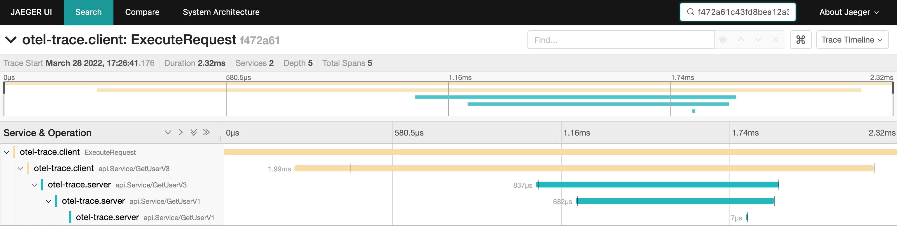

# OTEL traces



## install jaeger & otel-col

https://github.com/yubo/quick-start/tree/main/opentelemetry/02-demo

## server
- [config.yaml](./server/config.yaml)
```yaml
traces:
  serviceName: otel-trace.server
  contextHeadername: Trace-Id
  otel:
    endpoint: localhost:4317
    insecure: true

grpc:
  endpoint: 0.0.0.0:8081
  transport: tcp
```

```
$ go run ./server/main.go  -f server/config.yaml
```

## client

```
$ go run ./client/main.go
2022/03/28 17:26:41 tracer.Start traceID: f472a61c43fd8bea12a3496b93796fb8
I0328 17:26:41.176719   95653 grpcclient.go:26] "grpc.Dial" endpoint="127.0.0.1:8081"
2022/03/28 17:26:41 get user Name:"tom"
```
