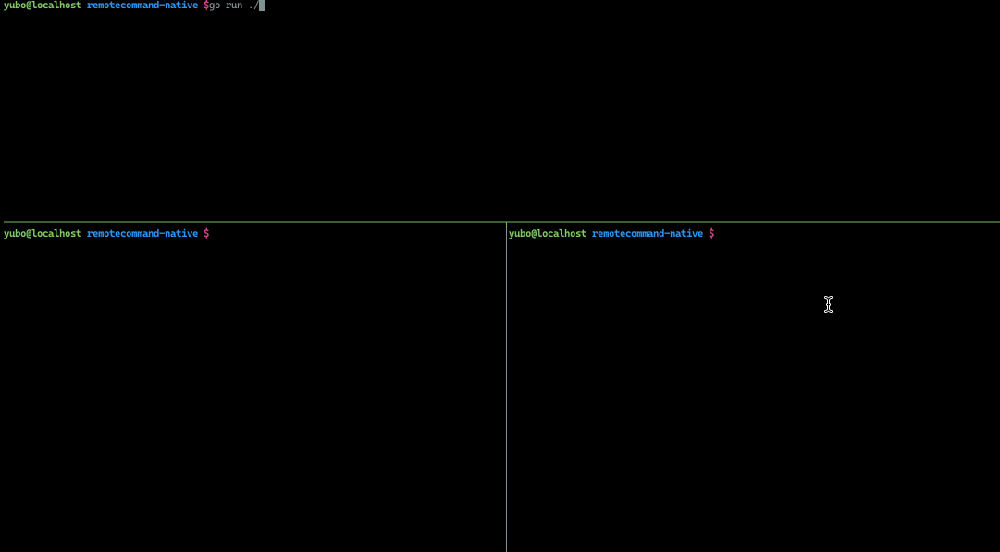

## Remotecommand - native



#### server

```sh
$ go run ./server/main.go -v 3
...
I0805 18:51:45.225584   77393 runtime.go:196] seesionid dvt7jvf9gz
```


#### client
```sh
$ go run client/main.go sh
```

#### attach

attach to container dvt7jvf9gz

```
$ go run ./client-attach/main.go dvt7jvf9gz
```

you can use `c-p` `c-q` detaching from the running container, like docker 


