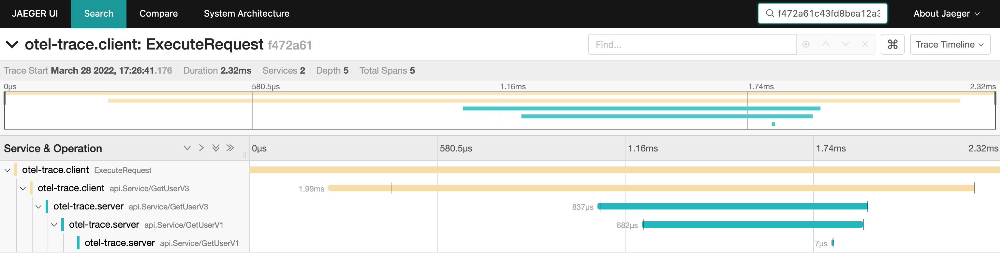

# tracing grpc



## install jaeger & otel-col

https://github.com/yubo/quick-start/tree/main/05-opentelemetry/01-otel-jaeger-promethues

## server

```
$ go run ./server/main.go  -f server/config.yaml
```

## client

```
$ go run ./client/main.go
2022/03/28 17:26:41 tracer.Start traceID: f472a61c43fd8bea12a3496b93796fb8
2022/03/28 17:26:41 get user Name:"tom"
```
