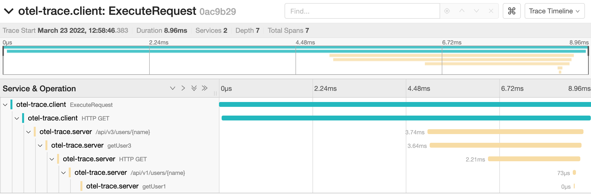

# tracing http



## install jaeger & otel-col

https://github.com/yubo/quick-start/tree/main/05-opentelemetry/01-otel-jaeger-promethues

```
flowchart LR
    /api/v1/users --> getUser1
    /api/v2/users --> getUser2 --> getUser1
    /api/v3/users --> getUser3 --> /api/v1/users
```

## server
- config .yaml
```
traces:
  serviceName: otel-trace.examples.apiserver
  contextHeadername: TraceID
  otel:
    endpoint: localhost:4317
    insecure: true
```

```
$ go run ./server/main.go  -f server/config.yaml
```

## client

- curl
```
$ curl -i http://localhost:8080/api/v3/users/tom
HTTP/1.1 200 OK
Cache-Control: no-cache, private
Content-Type: application/json
Trace-Id: 6c5179733f270984536a98ec347997b4
Date: Tue, 22 Mar 2022 12:21:12 GMT
Content-Length: 18

{
 "Name": "tom"
}
```

- client
```
$ go run ./client/main.go
2022/03/23 12:58:46 tracer.Start traceID: 0ac9b29f947be6f506f00fd807e5db08
2022/03/23 12:58:46 response traceID: 0ac9b29f947be6f506f00fd807e5db08
```
